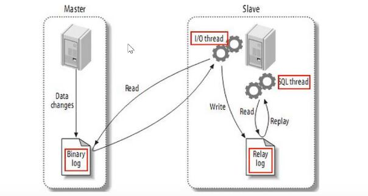
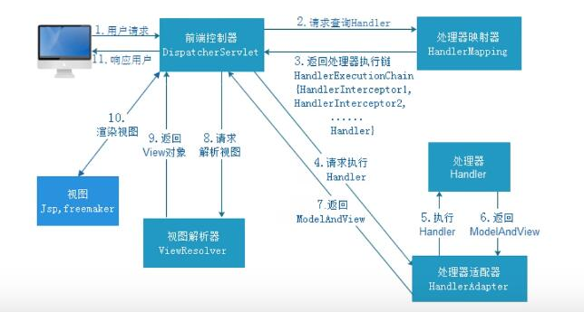
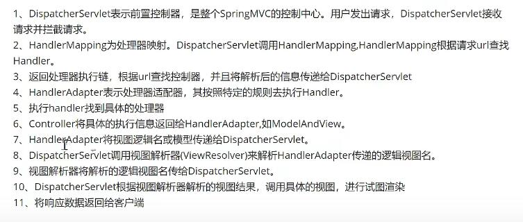
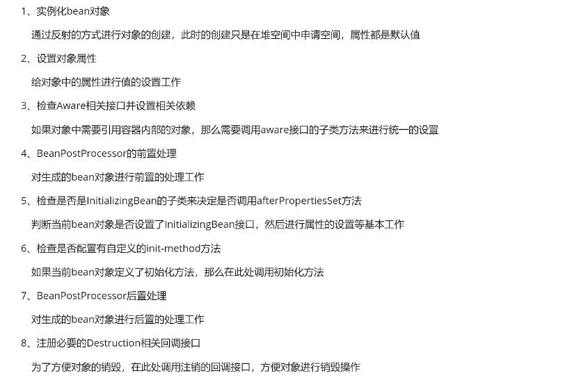
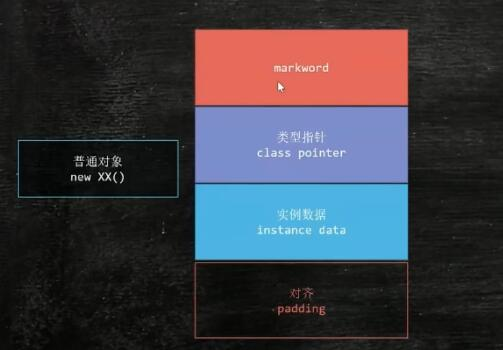
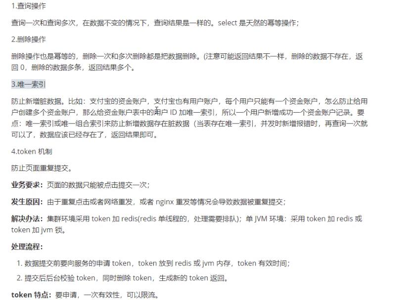
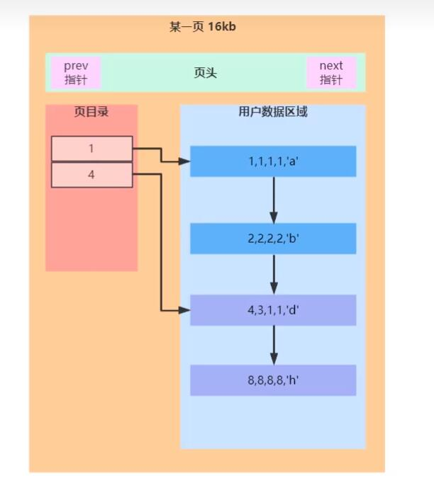
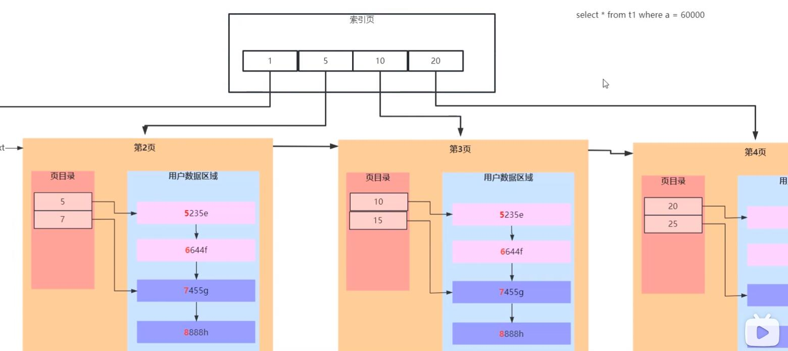
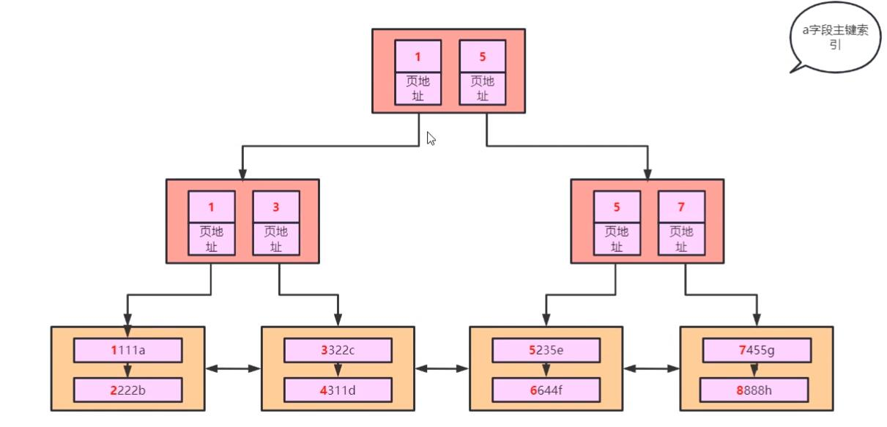
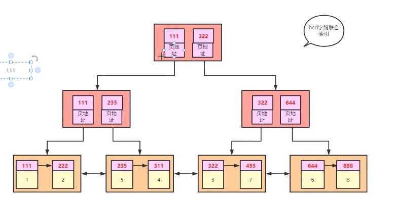

# 题目

## ACID是靠什么保证的

+ A(原子性) 靠的是undolog来保证,记录了要回滚的信息,事务发生回滚的时候撤销已经执行成功的sql
+ C(一致性)靠的是其他三大特征来保证业务上的一致
+ I(隔离性)靠的是MVCC机制
+ D(持久性)靠的是redolog来保证,修改数据时会保存日志到redolog中,就算数据没有保存成,只要日志成功,数据也不会丢失

## BeanFactory和ApplicationContext有什么区别

1. 相同点

+ spring提供了两种不同的IOC容器,BeanFactory和ApplicationContext,都是interface接口,其中ApplicationContext继承于BeanFactory

+ 它们都可以用来配置XML属性,支持属性自动注入

+ 都提供了getBean("bean name")来获取bean

2. 不同点

+ getBean实例化Bean时机不同,BeanFactory仅实例化bean,ApplicationContext在容器启动的时候实例化单例Bean,不会在调用getBean的时候实例化
+ BeanFactory不支持国际化,ApplicationContext支持国际化
+ ApplicationContext支持事件发布到注册为监听器的bean,BeanFactory不支持
+ 实现不同,BeanFactory核心实现是XMLBeanFactory,ApplicationContext核心实现是ClassPathXmlApplicationContext,web容器则是WebApplicationContext

3. 总结

BeanFactory提供基本的IOC和DI功能,ApplicationContext提供高级功能

## HashMap有哪些线程安全的方式

+ Collections.synchronizedMap
+ ConcueerntHashMap

## HashMap在扩容的时候做了什么优化

JDK1.8 二倍扩容,减少位置计算

## MVCC解决的问题是什么
```
数据库并发场景:
1. 读读: 不存在任何问题,不需要并发控制
2. 读写: 有线程安全问题,可能会造成事务隔离性问题,遇到脏读,幻读,不可重复读
3. 写写: 有线程安全问题,可能 存在更新丢失问题
```
MVCC是一种用来解决读写冲突的无锁并发控制.也就是为事务分配增长的时间戳,为每个修改保存一个版本,版本与时间戳关联,读操作只读事务开始前的数据库快照,所以可以解决以下问题:

1. 并发读写数据库时,可以左端读操作不阻塞写操作,写操作也不阻塞读操作,提供数据库并发读写性能
2. 解决脏读,幻读,不可重复读等事务隔离问题,但是不能解决更新丢失问题 


## MVCC实现原理

mvcc实现原理主要依赖于记录中的隐藏字段,undolog,read view来实现


## MySQL复制原理




+ 从库会生成2个线程,一个I/O线程,一个SQL线程
+ I/O线程会请求主库的binlog,得到binlog后会写到本地的relay-log(中继日志)文件中
+ 主库会生成一个log dump线程,给从库I/O线程传binlog
+ SQL线程会读取relay log文件,解析成sql语句进行逐一执行


## mysql 索引原理和结构

1. 索引结构

msql主要用到两种结构: B+ Tree索引和Hash索引

innodb存储引擎默认是B+Tree索引

Memory存储引擎默认Hash索引

+ Hash索引: 查询单条快,范围查询慢
+ Btree索引: B+树,层级越多,数据量指数级增长


## mysql锁类型

按锁的属性分为: 共享锁,排他锁

按锁的粒度分为: 行级锁,表级锁,页级锁

按锁的状态分为: 意向共享锁,意向排他锁

+ 共享锁: 共享锁又称读锁,简称S锁;当一个事务为数据加上读锁后,其他事务只能加读锁不能加写锁,直到所有读锁释放后才能加写锁.读锁主要支持鬓发读取数据,但不支持修改数据,避免出现重复读问题
+ 排它锁: 排它锁称写锁;当一个事务为数据加上写锁后,其他请求不能加任何锁,直到锁释放后才能对数据镜像加锁.目的为了防止数据修改时,不允许其他同事修改
+ 表锁: 整个表加锁
+ 行锁: 单挑记录加锁

## Myisam 和innodb的区别

innodb特点

+ 支持行锁
+ 支持外键
+ 支持事务
+ 支持mvcc模式读写

myisam特点
+ 不支持事务
+ 只是表锁和全文索引
+ 查询大量数据非常快

## mysql索引类型

+ 普通索引: 允许数据包含重复值
+ 唯一索引: 可以保证数据唯一性
+ 主键索引: 特殊的唯一索引,不允许为空
+ 联合索引: 覆盖多个数据列
+ 全文索引: 建立倒排索引,提高检索效率

## 索引设计原则
+ where后面出现的列,或者join指定的列
+ 基数小的表没必要建索引
+ 选择索引列,越短越好,没必要用全部字段值
+ 不要给每个字段都创建索引,不是越多越好
+ 定义有外键必须创建索引
+ 更新频繁的字段不要有索引
+ 创建索引列不要过多,可以创建组合索引,组合索引也不建议太多
+ 大文本,大对象不要创建索引


## springMVC 工作流程






## spirng事务传播机制

PROPAGATION_REQUIRED–支持当前事务，如果当前没有事务，就新建一个事务。这是最常见的选择。

PROPAGATION_SUPPORTS–支持当前事务，如果当前没有事务，就以非事务方式执行。

PROPAGATION_MANDATORY–支持当前事务，如果当前没有事务，就抛出异常。

PROPAGATION_REQUIRES_NEW–新建事务，如果当前存在事务，把当前事务挂起。

PROPAGATION_NOT_SUPPORTED–以非事务方式执行操作，如果当前存在事务，就把当前事务挂起。

PROPAGATION_NEVER–以非事务方式执行，如果当前存在事务，则抛出异常


## spring事务隔离级别有哪些
```
READ UNCOMMITED(未提交读)
问题:事务没提交,其他事务可看到数据,脏读
```
```
READ COMMITED(提交读)
大多数数据库系统的默认隔离级别是READ COMMITTED，这种隔离级别就是一个事务的开始，只能看到已经完成的事务的结果，正在执行的，是无法被其他事务看到的。这种级别会出现读取旧数据的现象

问题:事务执行到一半,其它事务不知道,可能读取了事务前的数据
```
```
REPEATABLE READ(可重复读)
问题:虽然读取同一条数据可以保证一致性，但是却不能保证没有插入新的数据
```
```
SERIALIZABLE(可串行化)
SERIALIZABLE是最高的隔离级别，它通过强制事务串行执行（注意是串行），避免了前面的幻读情况，由于他大量加上锁，导致大量的请求超时，因此性能会比较底下，再特别需要数据一致性且并发量不需要那么大的时候才可能考虑这个隔离级别
```

## spring事务实现方式原理

有两种事务实现方式,一种是编程式,用户自己通过代码控制事务,一种是声明式,通过注解@Transactional来实现


## spring事务什么时候会失效

1. bean对象没有被spring管理
2. 方法访问修饰符不是public
3. 自身调用问题
4. 数据源没有配置事务管理器
5. 数据库不支持事务
6. 异常被捕获
7. 异常类型错误或配置错误

## spring支持的bean作用域有哪些

1. singleton
2. prototype
3. request
4. session
5. global-session

## springBean生命周期



+ 实例化 Bean：通过反射调用构造方法实例化对象。
依赖注入：装配 Bean 的属性。
+ 实现了 Aware接口的 Bean，执行接口方法：如顺序执行 BeanNameAware、BeanFactoryAware、ApplicationContextAware的接口方法。
+ Bean 对象初始化前，循环调用实现了 BeanPostProcessor 接口的预初始化方法（postProcessBeforeInitialization）。
+ Bean 对象初始化：顺序执行 @PostConstruct 注解方法、InitializingBean 接口方法、init-method 方法。
+ Bean 对象初始化后，循环调用实现了 BeanPostProcessor 接口的后初始化方法（postProcessAfterInitialization）。
+ 容器关闭时，执行 Bean 对象的销毁方法，顺序是：@PreDestroy 注解方法、DisposableBean 接口方法、destroy-method


## Object obj = new Object()


1. 对象在内存情况



   + markword  8字节
   + class pointer 4字节
   + instance data 看类中属性项


## redis做分布式锁用什么命令

SETNX : setnx key value 当key不存在时设置成功,key存在设置失败

加锁 set key value nx ex 10s
释放锁 delete key

## 基于zookeeper分布式锁原理
主要基于 `顺序节点特性` 和 `临时节点特性`

使用ZooKeeper的顺序节点特性，假如我们在/lock/目录下创建3个节点，ZK集群会按照发起创建的顺序来创建节点，节点分别为/lock/000000001. /lock/000000002、 /lock/000000003, 最后一位数是依次递增的，节点名由zk来完成。

临时节点特性: ZK中还有一-种名为临时节点的节点，临时节点由某个客户端创建，当客户端与ZK集群断开连接,则该节点自动被删除。EPHEMERAL_ SEQUENTIAL为临时顺序节点。

逻辑如下,
1. 客户端调用create()创建 `/业务ID/lock`临时节点
2. 获取所有已创建 `业务ID`下的子节点
3. 判断客户端创建的子节点是否排第一,如果是,则认为获得了锁
4. 如果不是排第一,监听比自己小的节点,等待变更,再次伙子子节点判断是否获得锁

## mysql如何做分布式锁

   创建一个表,设置一个主键
   ```
   def lock :
       exec sq1: insert into locked-table (xxx) values (xxx)
     if result ==true :
        return true
    else :
         return false
def unlock :
      exec sq1: delete from lockedorder where order_id= ' order_id'

   ```

   ## 幂等有那些解决方案

   1. 查询操作
   2. 删除操作
   3. 唯一索引
   4. token机制




## synchronized和 ReentrantLock有哪些不同点

| synchronized | ReentrantLock |
|--------------|---------------|
 | java中的一个关键字 | JDK提供的一个类 |
 | 自动加锁和释放锁 | 手动加锁和释放锁 |
 | JVM层面的锁 | API层面的锁 |
 | 非公平锁 | 公平锁或非公平锁 |
 |锁的是对象，锁信息保存在对象头上 | int类型的state标识锁的状态 |
 | 底层有锁升级过程 | 没有锁升级过程 |


## synchronized的锁升级过程

1. 一开始对象拿到的锁称为偏向锁，在锁对象的对象头记录当前获得锁的线程ID，该线程下次再来直接能获取到锁，也就是支持锁重入
2. 当有第二个线程来竞争锁，锁会自动升级为轻量级锁，轻量级锁通过自旋来实现的，不会阻塞线程
3. 当自旋次数过多还没有获取到锁，会升级成重量级锁，重量级锁会导致线程阻塞


## innodb结构

innodb中最小存储单位为页,一页大小默认为16K

页包含`页目录`和`用户数据区域`

数据进行区间分组形成`页目录`



页多了查询效率慢,继续往上区间分组,形成`索引页`.叶子节点就是`数据页`



```
create table `t1`(
   a int primary key,
   b int ,
   c int ,
   d int ,
   e varchar(20)
) engine=InnoDB;
```

### 走索引原理

如图所示,索引结构


```
select * from t1 where a=6
直接走索引
-------------------
select * from t1 where a>6
先走索引找到6,然后再进行链表查询
-----------------
select * from t1 where b=6
直接链表查询,全表检索
```

### 联合索引结构


根据字段生成索引,但叶子节点保存的是`索引`和数据的`主键`,如果需要对应的数据,还需要通过`主键`去`回表`(主键索引表)查询对应的数据值

### 索引覆盖

索引分为`主键索引`和`二级索引`

如果辅助索引(二级)上已经存在我们需要的数据,那么引擎就不会去主键上去搜索数据了,称为`索引覆盖`


```
select * from t1 where b=1 and c=1 and d=1
走索引,不管后面字段顺序
-------------------
select * from t1 where b=1
能走索引,可以进行比较去查询
-----------------
select * from t1 where b>1 (不走索引)
select * from t1 where b>6 (走索引)
b>1,在头查询量大,如果走索引会进行大量回表查询,所以sql优化器直接让走全表查询,效率更快
b>6,查询量小,进行回表快,直接走索引,不进行sql优化
---------------------------
select * from t1 order by b,c,d (不走索引)
select b from t1 order by b,c,d (走索引)
select * 如果走索引,需要大量回表,全表扫描则更快,直接优化成不走索引
```

```
select * from t1 where a=1 (走索引)
select * from t1 where a='1' (走索引)
mysql会把字符转数字,数字字符直接转数字

select * from t1 where e='1' (走索引)
select * from t1 where e=1 (全表扫描)
e=1 字段转数字费时,sql优化直接全表更加快捷,全表扫描
```

## springboot的自动配置原理
1. 通过@SpringBootConfiguration引入`@EnableAutoConfiguration`(负责启动自动配置功能)
2. @EnableAutoConfiguration引入了`@Import`
3. spring容器启动时，加载ioc容易会解析@Import注解
4. @Import导入了一个`deferredImportSelector`（延迟导入）,它会使Springboot自动配置类的顺序在最后
5. 然后读取所有`/META-INF/spring.factories`文件
6. 过滤出所有的`AutoConfigurationClass`类型的类
7. 筛选出有效的自动配置类
