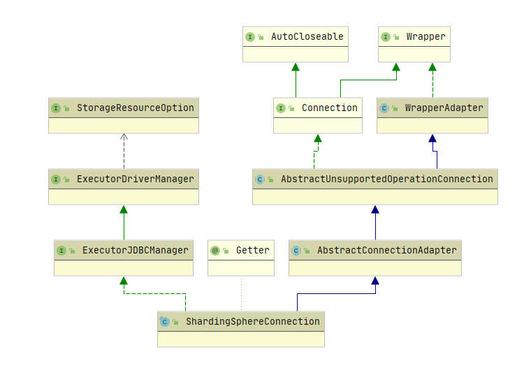

# shardingsphrer-jdbc流程

## 原理
包装原始的DataSource,做原生的JDBC增强,需要准备的是扩展标准JDBC需要的接口,扩展的类如下

|  JDBC接口  |          实现类          |
| :--------: | :----------------------: |
| Connection | ShardingSphereConnection |
|            |                          |
|            |                          |

从基本的JDBC流程看
```java
        Class.forName(DRIVERCLASSNAME);
 
        Connection conn = DriverManager.getConnection(URL,USERNAME,PASSWORD);
 
        String sql = "update user set nowtime = ? where uid = ?";
 
        PreparedStatement ps = conn.prepareStatement(sql);

 
        int i = ps.executeUpdate();

```
分几大步骤
1. 获取connection
2. 准备SQL执行statement
3. 执行


### Connection
`org.apache.shardingsphere.driver.jdbc.core.connection.ShardingSphereConnection`
类依赖如下



具体实现了Connection功能,核心方法是从原有的DataSource中获取连接
```java
    private Connection createConnection(final String dataSourceName, final DataSource dataSource) throws SQLException {
        return isInShardingTransaction() ? shardingTransactionManager.getConnection(dataSourceName) : dataSource.getConnection();
    }
```